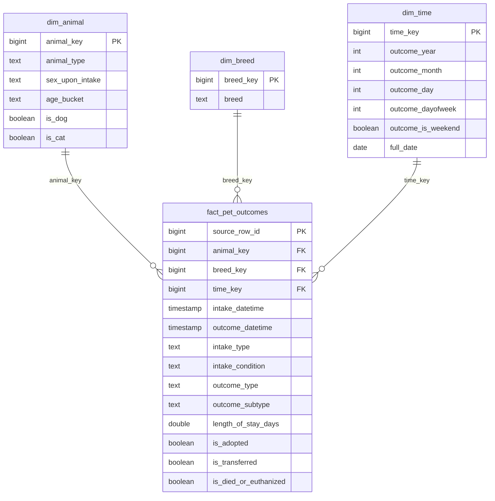

# 🐾 Austin Pet Adoption Data Pipeline

This project is an end-to-end data engineering pipeline built on the Austin Animal Center dataset. It ingests raw CSV data, transforms and validates it, and loads it into a dimensional warehouse modeled using a star schema for analytics.

The pipeline is orchestrated using a DAG-style workflow with explicit task dependencies, similar to Apache Airflow.

---

## Project Overview

This project demonstrates core data engineering concepts:

- Data ingestion from raw CSV
- Data cleaning and feature engineering
- Data quality validation
- Dimensional modeling (star schema)
- Analytical data marts
- DAG-style pipeline orchestration
- Query performance optimization with indexes

---

## Architecture

```
Raw CSV
   ↓
raw.raw_aac_intakes_outcomes
   ↓
staging.pet_features
   ↓
validation checks
   ↓
mart.dim_* + mart.fact_pet_outcomes
   ↓
mart summary tables
```

---

## Data Model (Star Schema)

### Fact Table
- `mart.fact_pet_outcomes`
  - Central table containing pet outcome events

### Dimension Tables
- `mart.dim_animal`
- `mart.dim_breed`
- `mart.dim_time`

This structure enables efficient analytical queries and is compatible with BI tools.

---

## Entity Relationship Diagram (ERD)



---

## Pipeline Flow (DAG)

```
ingest_data
   ↓
prepare_features
   ↓
validate_staging
   ↓
build_star_schema
   ├── build_mart_pet_outcome_summary
   └── build_mart_breed_adoption_summary
```

Each step is executed as a task, and dependencies are resolved using a DAG-style execution model.

---

## Data Quality Checks

Validation is performed on `staging.pet_features` before loading into the warehouse.

Checks include:

- Required fields (e.g., `animal_type`, `outcome_type`)
- Valid categorical values
- Logical consistency (e.g., outcome after intake)
- Feature correctness (e.g., adoption flags match outcome type)

Checks support:
- PASS
- WARN (within threshold)
- FAIL (pipeline stops)

---

## Indexing Strategy

Indexes are added to improve query performance:

- `animal_key`
- `breed_key`
- `time_key`
- `outcome_type`

These support fast joins and filtering in analytical queries.

---

## Example Queries

### 1. Adoption trends over time

```sql
SELECT 
    t.outcome_year,
    t.outcome_month,
    COUNT(*) AS total_adoptions
FROM mart.fact_pet_outcomes f
JOIN mart.dim_time t ON f.time_key = t.time_key
WHERE f.outcome_type = 'Adoption'
GROUP BY t.outcome_year, t.outcome_month
ORDER BY t.outcome_year, t.outcome_month;
```

---

### 2. Outcomes by animal type

```sql
SELECT 
    a.animal_type,
    f.outcome_type,
    COUNT(*) AS total
FROM mart.fact_pet_outcomes f
JOIN mart.dim_animal a ON f.animal_key = a.animal_key
GROUP BY a.animal_type, f.outcome_type
ORDER BY total DESC;
```

---

### 3. Top breeds by adoption count

```sql
SELECT 
    b.breed,
    COUNT(*) AS adoption_count
FROM mart.fact_pet_outcomes f
JOIN mart.dim_breed b ON f.breed_key = b.breed_key
WHERE f.outcome_type = 'Adoption'
GROUP BY b.breed
ORDER BY adoption_count DESC
LIMIT 10;
```

---

### 4. Average length of stay by animal type

```sql
SELECT 
    a.animal_type,
    ROUND(AVG(f.length_of_stay_days), 2) AS avg_stay_days
FROM mart.fact_pet_outcomes f
JOIN mart.dim_animal a ON f.animal_key = a.animal_key
GROUP BY a.animal_type
ORDER BY avg_stay_days DESC;
```

---

## Project Structure

```
Austin-Pet-Adoption/
│
├── data/
│   └── raw/
│
├── src/
│   ├── ingest_data.py
│   ├── prepare_features.py
│   ├── validate_staging.py
│   ├── build_star_schema.py
│   ├── build_mart_pet_outcome_summary.py
│   ├── build_mart_breed_adoption_summary.py
│
├── run_pipeline.py
├── README.md
```

---

## How to Run

### 1. Start Postgres (Docker)

```
docker start austin_pet_postgres
```

### 2. Run the pipeline

```
python run_pipeline.py
```

---

## What This Project Demonstrates

- End-to-end pipeline design
- Dimensional modeling for analytics
- Data validation and quality enforcement
- Orchestration with dependency management
- Production-style thinking in data workflows

---

## Future Improvements

- Add Airflow or Prefect orchestration
- Add dbt for transformations
- Add API layer for data access
- Add dashboards (Tableau / Power BI)
- Add automated tests and CI/CD

---

## Author

Mark Young  
Data Analyst → Data Engineer  